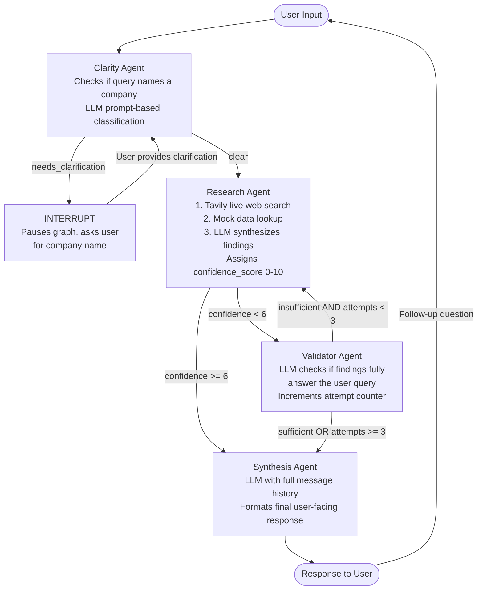

# multi-agent-workflow

A LangGraph multi-agent research assistant for company information queries. Combines Tavily live web search with four specialized LLM agents, human-in-the-loop clarification, and a Next.js chat UI. Built for the turing-interview exercise.

---

## Architecture



### Routing table

| From | To | Condition |
|---|---|---|
| Clarity | INTERRUPT | No company name in query |
| Clarity | Research | `clarity_status = "clear"` |
| Research | Validator | `confidence_score < 6` |
| Research | Synthesis | `confidence_score >= 6` (fast path) |
| Validator | Research | `validation_result = "insufficient"` AND `attempts < 3` |
| Validator | Synthesis | `validation_result = "sufficient"` OR `attempts >= 3` |

---

## Example Queries & Agent Paths

### 1. Clear query -- fast path (confidence >= 6)
```
You: What is happening with Apple lately?
```
**Agents used:** `clarity` -> `research` -> `synthesis`
**Tools:** LLM (clarity check), Tavily search + mock data, LLM (synthesis)
**Path:** Clarity scores it clear -> Research finds rich data, confidence=9 -> skips Validator -> Synthesis responds

### 2. Vague query -- triggers human-in-the-loop interrupt
```
You: Tell me about a big tech company
Assistant: Your query is vague -- which specific company are you asking about?
You: Tesla
```
**Agents used:** `clarity` -> INTERRUPT -> `clarity` -> `research` -> `synthesis`
**Tools:** LLM (clarity), `interrupt()` pause, LLM (clarity re-run on resume), Tavily + mock data, LLM (synthesis)
**Path:** Clarity detects no company -> interrupt() pauses graph -> user clarifies "Tesla" -> graph resumes, clarity re-runs -> research -> synthesis

### 3. Unknown company -- validator retry loop
```
You: Tell me about Stripe
```
**Agents used:** `clarity` -> `research` -> `validator` -> `research` -> `validator` -> `synthesis`
**Tools:** LLM (clarity), Tavily (limited results, low confidence), LLM (validator rejects), Tavily retry, LLM (validator accepts or max attempts reached), LLM (synthesis)
**Path:** No mock data for Stripe -> Tavily returns some results but confidence < 6 -> Validator may loop up to 3 times -> Synthesis with best available findings

### 4. Multi-turn follow-up conversation
```
Turn 1 -- You: What is happening with Tesla?
Turn 2 -- You: Who is their CEO?
Turn 3 -- You: Tell me more about the FSD technology
```
**Agents used (each turn):** `clarity` -> `research` -> `synthesis`
**Multi-turn:** MemorySaver checkpointer accumulates all messages. Synthesis agent receives full history so follow-up answers reference prior context.

### 5. Poorly worded but specific query
```
You: apple stock news recent stuff
```
**Agents used:** `clarity` -> `research` -> `synthesis`
LLM in Clarity is lenient -- if a company name is present the query passes as "clear" even with informal phrasing.

---

## State Schema

| Field | Type | Description |
|---|---|---|
| `messages` | `list[BaseMessage]` | Full conversation history, append-only via `add_messages` reducer |
| `query` | `str` | Current query (updated to clarification text if interrupt fires) |
| `clarity_status` | `"clear" or "needs_clarification"` | Set by Clarity Agent |
| `research_findings` | `str` | Synthesized output from Research Agent |
| `confidence_score` | `int 0-10` | Research Agent self-rating |
| `validation_result` | `"sufficient" or "insufficient"` | Validator Agent verdict |
| `research_attempts` | `int` | Retry counter, resets to 0 on each new conversation turn |

---

## Project Structure

```
multi-agent-workflow/
+-- src/
|   +-- state.py          # TypedDict state schema
|   +-- data.py           # Mock research data (Apple, Tesla)
|   +-- llm.py            # OpenRouter LLM factory
|   +-- graph.py          # LangGraph StateGraph + routing
|   +-- agents/
|       +-- clarity.py    # Clarity agent + interrupt
|       +-- research.py   # Tavily search + LLM synthesis
|       +-- validator.py  # Quality checker
|       +-- synthesis.py  # Final response with history
+-- frontend/
|   +-- app/
|   |   +-- page.tsx          # Chat UI (React)
|   |   +-- layout.tsx
|   |   +-- globals.css
|   |   +-- api/chat/route.ts    # Proxy to Python backend
|   |   +-- api/clarify/route.ts
|   +-- package.json
|   +-- next.config.js
+-- api.py            # FastAPI server (wraps LangGraph)
+-- main.py           # CLI entry point
+-- workflow.html     # Visual architecture guide
+-- pyproject.toml
+-- .env.example
+-- .gitignore
```

---

## Setup

### Prerequisites
- Python 3.11+
- Node.js 18+
- uv (`pip install uv`)

### 1. Clone and install Python dependencies
```bash
uv sync
```

### 2. Configure environment
Copy `.env.example` to `.env`:
```
OPENROUTER_API_KEY=sk-or-...
TAVILY_API_KEY=tvly-...
MODEL_NAME=openai/gpt-4o-mini

# LangSmith tracing (already set up for turing-interview project)
LANGCHAIN_API_KEY=lsv2_...
LANGCHAIN_TRACING_V2=true
LANGCHAIN_PROJECT=turing-interview
```

### 3. Install frontend dependencies
```bash
cd frontend && npm install
```

---

## Running the System

### Option A: Chat UI (recommended)

**Terminal 1 -- Python backend:**
```bash
uv run uvicorn api:app --port 8000 --reload
```

**Terminal 2 -- Next.js frontend:**
```bash
cd frontend && npm run dev
```

Open `http://localhost:3000`

### Option B: CLI
```bash
uv run main.py
```

---

## LangSmith Tracing

All agent runs are automatically traced to the `turing-interview` project on LangSmith when `LANGCHAIN_TRACING_V2=true` and `LANGCHAIN_API_KEY` are set.

View traces at: https://smith.langchain.com/o/your-org/projects/turing-interview

Each trace shows:
- Full agent execution tree
- LLM prompts and responses per agent
- Confidence scores and routing decisions
- Token usage

---

## Deploying the UI to Vercel

1. Push the repo to GitHub
2. Create a new Vercel project, set **Root Directory** to `frontend/`
3. Add environment variable on Vercel: `BACKEND_URL=https://your-backend-url.com`
4. Deploy the Python backend separately (Railway, Render, Fly.io, etc.)

---

## Assumptions

- Company name matching in mock data uses case-insensitive substring search
- `research_attempts` resets to 0 at the start of each new conversation turn
- When an interrupt fires, the clarification text is added as a `HumanMessage` to the conversation history
- LLM temperature is 0 for deterministic routing decisions
- Tavily search fails gracefully -- if no API key or network error, falls back to mock data only
- The validator loop exits at 3 attempts regardless of `validation_result` to prevent infinite loops
- Follow-up questions may trigger fresh Tavily searches on each turn for up-to-date info

---

## Beyond Expected Deliverable

- **Live web search via Tavily**: Research Agent queries the real web instead of relying only on static mock data
- **Dual data sources**: Combines Tavily live results with curated mock data (Apple, Tesla); LLM synthesizes both
- **FastAPI REST backend**: `api.py` exposes the graph as HTTP endpoints (`/chat`, `/clarify`, `/health`) enabling any frontend to consume it
- **Next.js chat UI**: Full React chat interface with real-time agent trace visualization, deployed to Vercel
- **Agent trace visualization**: UI shows exactly which agents ran (clarity -> research *9 -> synthesis) with confidence scores inline
- **Human-in-the-loop in UI**: Clarification prompts appear as special amber cards with inline input -- no page reload needed
- **OpenRouter integration**: Model-agnostic -- swap LLMs by setting `MODEL_NAME` (GPT-4o, Claude, Mistral, etc.)
- **LangSmith tracing**: Full observability -- every agent run, LLM call, and routing decision is traced to `turing-interview` project
- **Multi-turn memory in UI**: MemorySaver persists conversation state across turns using `thread_id` (UUID per browser session)
- **Suggested prompts**: UI shows clickable example queries to demonstrate all agent paths
